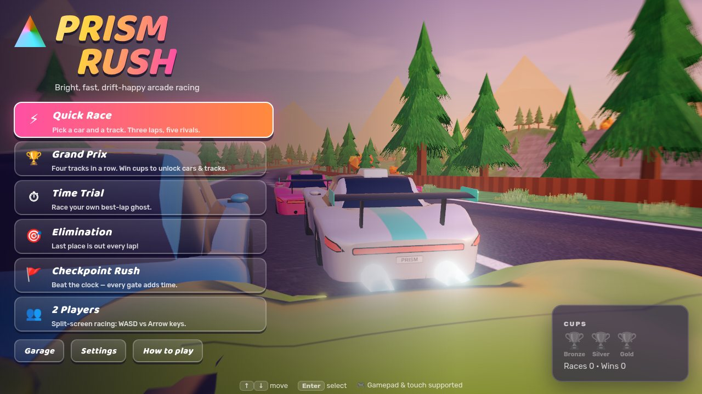
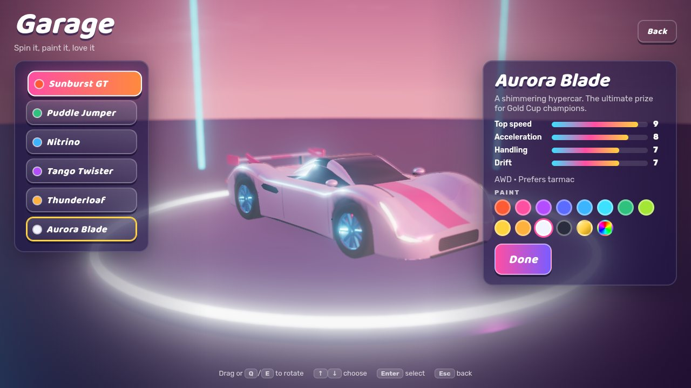
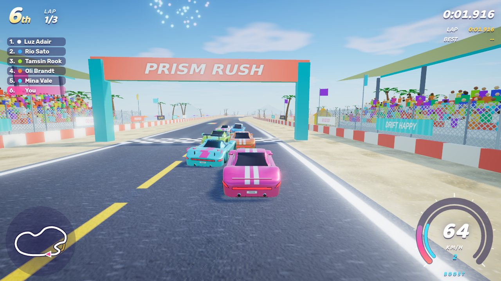
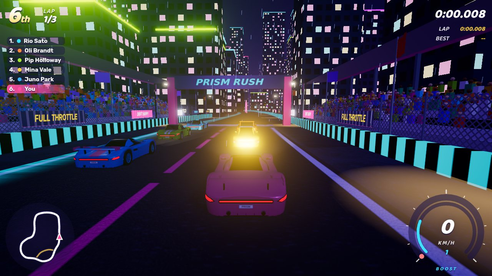
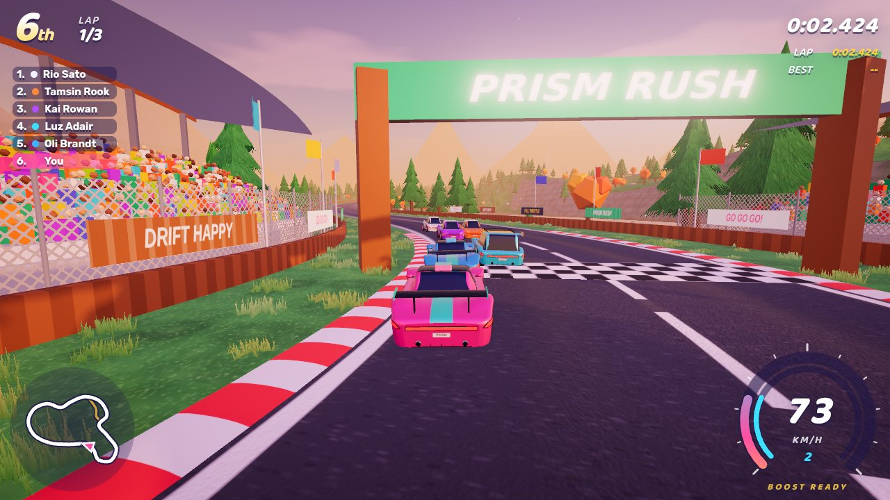
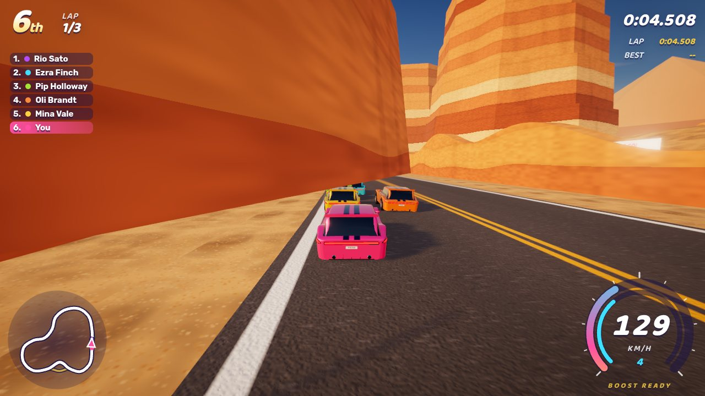
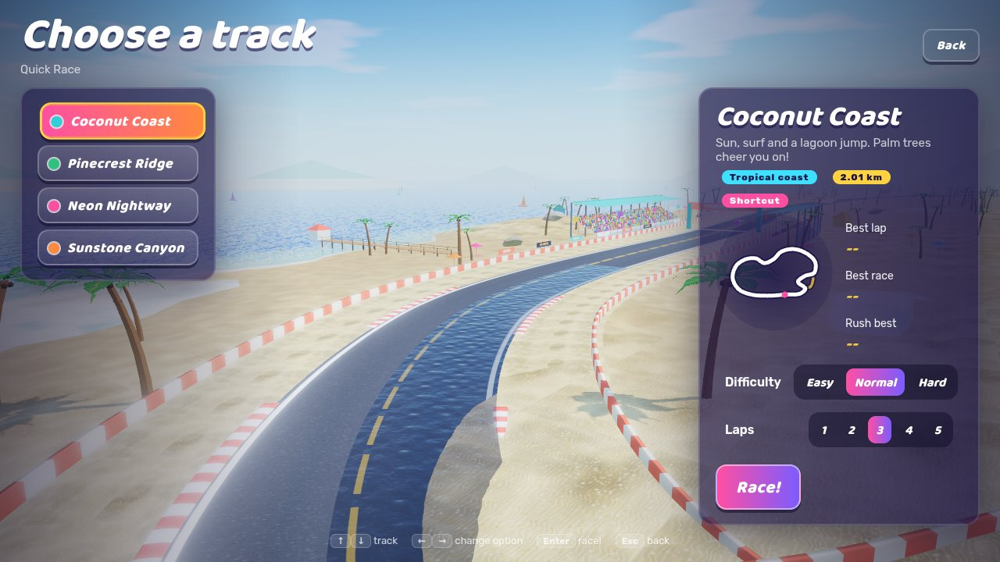
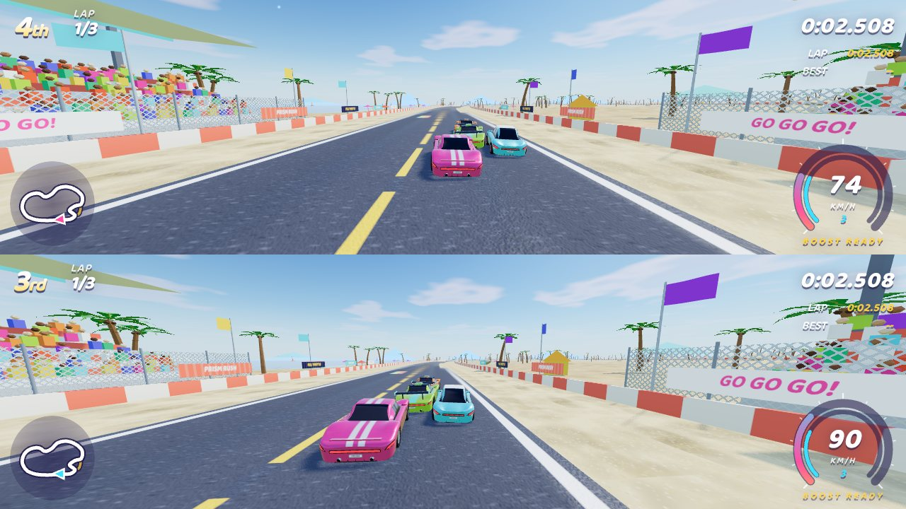
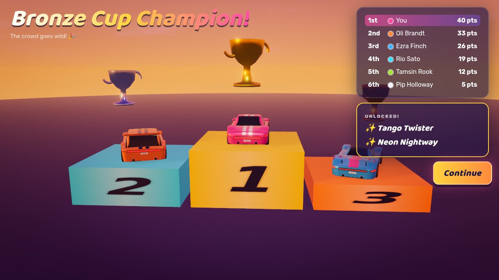

# Prism Rush

Prism Rush is a bright, cheerful 3D arcade racer that runs in the browser. It is built with **Vite + TypeScript + Three.js**. The drift physics are its own arcade model, and there are six game modes, AI rivals, split-screen, gamepad and touch support.

All the cars, tracks, textures, music and sound effects are **generated in code**. There are no downloaded assets, so the game runs straight after `npm install`.

> Made for players aged 12+. There are no crashes with damage, no gambling mechanics, no ads and no in-app purchases. Bumps are soft, and knocked-out cars fade away in a puff of confetti.

**Play online:** https://theerapongkundern-glitch.github.io/game/ (after GitHub Pages is enabled; see [Deploying](#deploying-to-github-pages)).

| | |
| --- | --- |
|  |  |
|  |  |
|  |  |
|  |  |
|  | |

---

## Quick start

```bash
npm install
npm run dev        # http://localhost:5173
```

| Script | What it does |
| --- | --- |
| `npm run dev` | Dev server with hot reload |
| `npm run build` | Type-check and build the production bundle into `dist/` |
| `npm run preview` | Serve the production build |
| `npm test` | Unit tests (physics, tracks, AI races on every track, game modes, ghosts, saves) |
| `npm run typecheck` | TypeScript only |
| `npm run smoke` | End-to-end browser test of every mode (run `npm run build` first; needs a Chromium, see below) |

Requirements: Node 20.19+ (Node 22 recommended). It runs in current Chrome, Edge, Firefox and Safari (WebGL 2).

## Controls

| Action | Player 1 / single player | Player 2 | Gamepad | Touch |
| --- | --- | --- | --- | --- |
| Accelerate | `W` | `↑` | RT | GO |
| Brake / reverse | `S` | `↓` | LT | BRAKE |
| Steer | `A` `D` | `←` `→` | Left stick / D-pad | ◀ ▶ |
| Handbrake / drift | `Space` | `Right Ctrl` or `/` | A (or X) | DRIFT |
| Boost | `Left Shift` | `Right Shift` | B or RB | BOOST |
| Change camera (chase / close / bumper) | `C` | `.` | Y | 📷 |
| Look back | `Q` | `,` | — | — |
| Reset to track | `R` | `Enter` | Back / View | — |
| Pause | `P` or `Esc` | `P` or `Esc` | Start | ❚❚ |

- In single player, both keyboard layouts work, so the arrow keys and WASD are interchangeable.
- Every key can be remapped in **Settings → Controls**, separately for each player.
- Menus work with the mouse, arrow keys + `Enter`/`Esc`, or a gamepad (D-pad/stick + A/B, with LB/RB to switch tabs).

**Driving tips**

- Tap the handbrake while turning to start a drift.
  - Steering into the corner tightens the drift; straightening the wheel exits it.
  - Drifting fills the boost bar, and so does slipstreaming close behind a rival.
- Hold throttle just before **GO** for a *perfect start*.
- Surfaces matter:
  - asphalt grips
  - wet roads are slippery
  - grass and sand slow you down
  - dirt shortcuts are a trade-off
  - rainbow pads give a free boost

## Game modes

1. **Quick Race:** choose car, paint, track, difficulty and laps (3 by default) against 5 AI rivals.
2. **Time Trial:** solo laps against a translucent **ghost** of your best lap, with a live time gap to it. The best laps and ghosts are saved per track.
3. **Grand Prix:**
   - All four tracks in a row, scored 10/8/6/4/2/1, with standings after each race.
   - The finale is a 3D **podium** with trophies.
   - Win the **Bronze** (Easy), **Silver** (Normal) or **Gold** (Hard) cup to unlock cars and tracks.
4. **Elimination:** each time the leader starts a new lap, the last-place car is knocked out. The last one standing wins.
5. **Checkpoint Rush:** beat the clock over 3 laps. Each of the 8 rainbow gates per lap adds seconds.
6. **2 Players:** top/bottom split-screen, WASD vs arrow keys (or two gamepads), with AI rivals.

### Cars

| Car | Style | Speed | Accel | Handling | Drift | Unlock |
| --- | --- | --- | --- | --- | --- | --- |
| Sunburst GT | balanced coupe | 6 | 7 | 6 | 5 | start |
| Puddle Jumper | rally hatch, great off-road | 5 | 6 | 8 | 5 | start |
| Nitrino | tiny zippy EV | 4 | 9 | 7 | 5 | start |
| Tango Twister | drift coupe | 7 | 6 | 6 | 9 | Bronze Cup |
| Thunderloaf | muscle wagon | 9 | 6 | 5 | 6 | Silver Cup |
| Aurora Blade | hypercar | 9 | 8 | 7 | 7 | Gold Cup (+ gold paint) |

### Tracks

| Track | Theme | Features | Unlock |
| --- | --- | --- | --- |
| Coconut Coast | tropical beach, day | lagoon-side jump, dirt "Dune dash" shortcut, wet surf line, a sea with shallows and surf, a pier, sailboats | start |
| Pinecrest Ridge | mountain forest, sunset | big climbs, creek jump, "Logging trail" shortcut, wet bridge, needle pines, wind-blown grass, valley mist, fireflies | start |
| Neon Nightway | neon city, night | rain-slick corners, plaza ramp, "Back alley" shortcut, glass towers, wet-road neon reflections, an overpass, traffic lights, steam vents, headlight beams | Bronze Cup |
| Sunstone Canyon | desert canyon, golden hour | huge canyon jump, "Slot canyon" shortcut with boost pad, banded sandstone mesas, tumbleweeds, dust devils, heat haze, balloons | Silver Cup |

Every track has grandstands with a cheering crowd, flags, banners and a catch fence at the start line, and fireworks go off at the start and when you finish.

Progress is saved in `localStorage` (key `prism-rush.save`), including:

- best laps, race times and Checkpoint Rush times
- ghosts, cups and unlocks
- paint choices and settings

**Settings → Progress** has "Unlock everything" (handy for testing) and "Reset progress".

## Settings & performance

- **Graphics quality** (Settings → General):
  - **Low:** no shadows or post-processing, simple materials, fewer props. For phones and older GPUs; touch devices start here.
  - **Medium:** physical sky, realistic materials (clearcoat paint, asphalt detail, rippled water), skid marks, shadows and light motion blur.
  - **High:** everything in Medium plus larger shadow maps, bloom, 4× MSAA, a sun lens flare, heat haze in the desert, wind-blown grass and depth of field in the garage. This is the 60 FPS target on a mid-range laptop.
  - **Ultra:** 4096 shadow maps, ambient occlusion (GTAO), denser grass and particles, light shafts through the forest, and higher-detail cars and terrain.
- **Auto resolution** lowers the render resolution when frames get slow, and raises it again when there is headroom.
- Physics runs at a fixed **120 Hz** with render interpolation. Scenery is instanced, and car parts are merged per material (about 20 draw calls per car).
- On High, the heaviest track is about 270 draw calls and 650k triangles, including the shadow pass. `npm run smoke` enforces a budget of 300 draw calls and 1M triangles on High.
- URL switches:
  - `?quality=low|medium|high|ultra` overrides the saved quality.
  - `?debug` (or `F3` in a race) shows a physics/renderer overlay.
  - `?mute` silences audio.

### How the graphics work

- **Sky and light:** a physically based (Preetham) sky with drifting clouds, graded towards each track's colours so it stays bright and cheerful. It's rendered into an environment map, so cars, glass and water reflect it. ACES tone mapping, bloom and a lens flare finish the image.
- **Cars** are lofted from ~30 rounded cross-sections that follow each car's side profile. Wheel arches are carved in and the fenders flare over the tyres. Lights, grilles, vents and skirts are "decals" that hug the body surface. Paint has a clearcoat layer, and stripes and panel seams are painted on in the shader.
- **Tracks:** asphalt has aggregate grain, cracks and polished tyre lanes; curbs are raised; puddles ripple. The terrain blends in rock on steep slopes and a wet band by the water. The sea reads the terrain height, so it shows turquoise shallows, rolling surf and deep water.
- **Effects:** tyre smoke, skid marks that stay on the road, spark streaks, shock-diamond boost flames, backfire pops, headlight beams at night and fireworks.

## Project structure

```
src/
  core/      Game (app state machine), Loop (fixed step), Renderer (quality tiers, dynamic resolution),
             PostFX (motion blur, bloom, AO, depth of field, heat haze), Sky (physical sky, flare),
             CameraRig, Particles (+ spark streaks), SkidMarks, SpeedLines,
             Input (keyboard/gamepad/touch, remapping), Save (versioned localStorage), World
  vehicles/  CarDefs (the 6 cars), VehiclePhysics (arcade tyre model + drift), CarModel (lofted
             procedural bodies, wheels, lights), carTextures (grille/chrome atlas, tyre tread),
             Car (physics + visuals + effects), Ghost (record/encode/playback)
  tracks/    Track (spline sampling & fast queries), TrackBuilder (road, curbs, barriers, ramps,
             terrain shading, water), Surfaces, themes, textures (canvas-generated), strata (rock
             bands), defs/ (track data), scenery/ (trackside stands + beach, city, forest, desert)
  ai/        RacingLine (curvature-minimising line + speed profile), AIDriver, Difficulty
  modes/     RaceSim (pure race logic, runs headless in tests), RaceSession (rendering + HUD),
             QuickRace, TimeTrial, GrandPrix, Elimination, CheckpointRush, SplitScreen
  ui/        screens/ (menu, garage, track select, settings, pause, results, standings, podium…),
             scenes/ (attract mode, garage turntable, track flyover, podium), HUD, Minimap,
             TouchControls, FocusNav (gamepad/keyboard menus), CSS
  audio/     AudioEngine (buses), EngineSound (RPM-driven synth), SFX, Music (sequencer), RaceAudio
tests/       Vitest unit tests (+ a headless race harness)
scripts/     smoke.mjs (end-to-end browser test), shot.mjs (screenshot helper)
```

### How it works (short version)

- **Physics.** A bicycle-model tyre simulation, with an arcade layer on top for jumps and wall bumps.
  - Tyres: slip angles per axle, longitudinal weight transfer, a rear friction circle and speed-sensitive steering.
  - Drift: once you enter it with the handbrake, the velocity turns at a grip-limited rate. The nose holds an angle you control with the steering, so it never spins out.
  - Boost and jumps: the boost meter fills from drifting and drafting. Ramps launch the car when the ground drops away under it.
- **Tracks** are closed Catmull-Rom splines sampled every 2 m.
  - Each car caches its position on the spline, so a track query costs almost nothing and returns lateral offset, ground height, surface, walls and lap progress.
  - Shortcuts are extra paths that map onto main-loop progress.
- **AI** drives with exactly the same physics as you.
  - It follows a racing line (elastic-band relaxation) with pure-pursuit steering and a braking-aware speed profile.
  - It overtakes, boosts on straights and decides on shortcuts.
  - On Easy it has gentle rubber-banding.
- **Audio** is all Web Audio synthesis:
  - an engine voice whose pitch follows a simulated gearbox's RPM
  - tyre screech, wind and a boost whoosh
  - a step-sequencer music engine with a different song per track theme

## Adding a new track

1. Create `src/tracks/defs/myTrack.ts` exporting a `TrackDef` (see `src/tracks/types.ts`):

   ```ts
   import type { TrackDef } from '../types';

   export const myTrack: TrackDef = {
     id: 'my-track',
     name: 'My Track',
     tagline: 'Short description for the track card.',
     theme: 'forest',            // beach | city | forest | desert (props, road look, barriers)
     sky: 'sunset',              // day | sunset | golden | night | dusk
     music: 'forest',
     scale: 1.1,                 // optional uniform scale of x/z
     width: 15,                  // road width (m)
     shoulder: 6,                // run-off before the barrier (m)
     shoulderSurface: 'grass',
     seed: 1234,                 // scenery placement
     colors: { primary: '#2ec27e', secondary: '#ffd23f' },
     points: [                   // closed loop; point 0 = start/finish, put it on a straight
       { x: 0, z: 0 }, { x: 0, z: 150 }, { x: 80, z: 240, y: 6, bank: -4 }, /* … */
     ],
     surfaces: [{ from: 3.2, to: 4.5, type: 'wet' }],          // positions in control-point units
     ramps: [{ at: 1.5, length: 15, height: 2, width: 8 }],
     boostPads: [{ at: 0.4, offset: 3 }],
     shortcuts: [{ from: 6, to: 8, via: [{ x: 120, z: 60 }], width: 9, surface: 'dirt', name: 'Cut' }],
     rush: { start: 25, perGate: 7.5 },                         // Checkpoint Rush clock
   };
   ```

2. Register it in `src/tracks/index.ts`: add it to `TRACKS` (Grand Prix order) and give it an unlock in `TRACK_UNLOCKS`.
3. Run `npm test`. The AI tests race every registered track automatically: they check that the racing line stays on the road, that six AI cars finish without getting stuck, and that the Rush clock is beatable.

Layout tips:

- Keep non-neighbouring parts of the loop at least ~2 × (width/2 + shoulder) + 10 m apart.
- Keep corners smooth: control points ~40–120 m apart.
- `bank` is in degrees. Positive raises the left edge (use it for right-hand turns).
- On a shortcut, positions (`surfaces`/`ramps`/`boostPads` with `shortcut: 0`) are a 0–1 fraction of its length.
- A brand-new theme needs an entry in `src/tracks/themes.ts` and a scenery builder in `src/tracks/scenery/`.

## Adding a new car

Add an entry to `CAR_DEFS` in `src/vehicles/CarDefs.ts`:

- **stats**: `speed`, `accel`, `handling` and `drift`, each 1–10. They drive every physics parameter through `deriveParams()`.
- **handling traits**: `offroad` (0–1), `mass` and `drive` (`rwd` / `awd` / `fwd`).
- **shape**: length, width, heights, wheelbase, wheel size, cabin placement, side-profile points, spoiler style and extras such as `roofScoop`, `bullbar` or `fins`. Looks are set by `rimStyle` (`five`, `multi`, `mesh`, `turbine`, `dish`), `flare` (fender flare in metres), `lightStyle` (`slim`, `wide`, `round`), `stripes` (`none`, `twin`, `center`, `flank`), and the optional `roof` (`paint`, `accent`, `black`) and `caliper` colour.
- **engine**: `pitch`, `growl` and `cylinders` (0 = electric whine).
- **unlock**: `start`, `bronze`, `silver` or `gold`.

The car appears in the garage, AI fields and every mode automatically. `npm test` checks that it accelerates, reaches its top speed and drifts sensibly.

## Testing

- `npm test` runs the Vitest suite. `tests/helpers/headless.ts` can race any mode headlessly through `RaceSim`, with no browser needed.
- The game has a test hook: `/?autotest=<quick|timetrial|grandprix|elimination|rush|split>&track=<id>&laps=1&fast=10`.
  - The AI drives the player car at up to 10× speed.
  - Results appear in `window.__autotest`.
- `npm run smoke` serves `dist/` and drives every mode in headless Chromium.
  - It checks for console errors, touch controls on a phone viewport and the rendering budget.
  - It saves screenshots to `screenshots/`.
  - It uses `CHROME_PATH` if set; otherwise install a browser with `npx playwright install chromium`.

## Deploying to GitHub Pages

`.github/workflows/deploy.yml` runs on every push to `main` (or by hand from the Actions tab). It installs, tests, builds and publishes `dist/` to GitHub Pages. Vite uses `base: './'`, so the build works under any sub-path.

One-time repository setup:

1. The repository must be **public** (or on a plan that allows Pages for private repositories).
2. **Settings → Pages → Build and deployment → Source: GitHub Actions**.
3. Push to `main`, or run the workflow manually. The game appears at `https://<user>.github.io/<repo>/`.

## Credits & licence

- Code: MIT licence.
- Fonts: Baloo 2 and Rubik (SIL Open Font License), bundled through `@fontsource` and served locally.
- All art, names, tracks, cars, music and sound are original and generated procedurally in code.
